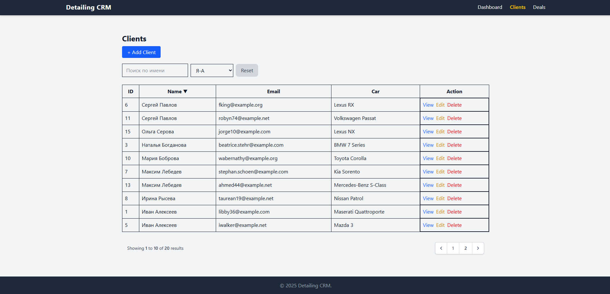
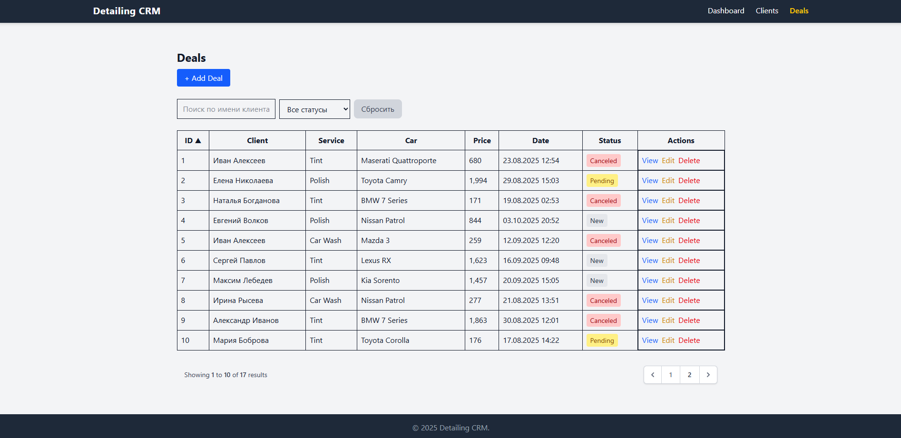
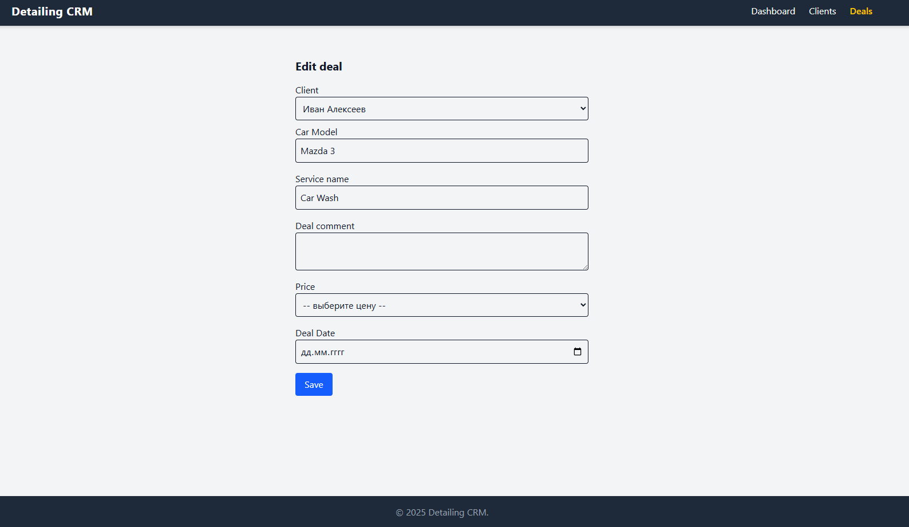

# CRM.detailing

CRM.detailing - система для хранения клиентов и сделок в детейлинге. Весь учет в студии вёлся на доске или в голове у владельца, поэтому остро стоял вопрос автоматизации бизнеса.ъ

От приложения требовалась демонстрация моего мышления, то какими паттернами пользуюсь при разработке. Проект небольшой, но с хорошим фундаментом под будущее масштабирование благодаря тому, что всегда придерживался принципа decoupling.

Приложение представляет собой Minimal Viable Product. 
## Постановка задачи

Поскольку бизнес-задача стояла улучшить процесс взаимодействия с клиентами я выбрал следующий инструментарий для реализации:
- PHP 8 (позволяет получать аналитику, безопасность, автоматизировать под личные нужды)
- Laravel 12 + Tailwind (позволяет просто и быстро написать приложение под нашу цель, MVC-фреймворк)
- Livewire (позволяет просто писать динамический интерфейс на странице)
- MySql (всегда беру при написании подобных приложений)

## Демонстрация

### Dashboard

На данной странице ничего особенного, просто вывод нескольких переменных, в которые подтягивается информация с бд. Реализовано с помощью Eloquent ORM.

Это главная страница приложения, которая открывается по умолчанию.

### Страница со списком клиентов

На этой странице представлена таблица с данными из таблицы Clients. Также небольшой набор фильтров: поиск по имени (с помощью Livewire реализован функционал мнгновенного поиска при вводе символа) и сортировка по алфавиту по нажатию на колонку (Livewire).

Изначально был реализован обычный поиск по конечному слову и кнопка Filter, но потом пришла идея реализовать поиск, описанный выше и спустя время решил воспользоваться готовой библиотекой livewire, что ускорило процесс в разы.

### CRUD для клиентов

Изначально вся логика по добавлению, изменению, валидации находилась в одном контроллере, что со временем выглядело как сборная солянка, и для решения этой проблемы я решил:
- Вынести валидацию в отдельный `FormRequest` где прописал все правила для создания/изменения информации для клиента. 
- Вынес всю инфраструктурную логику в отдельный `ClientSerivce`, что позволило разгрузить контроллер и придерживаться `SPR` принципу
- Далее решил обезопасить данные, которые поступают с форму с помощью Data Transfer Object (`DTO`). Возможно для такого приложения применение этого принципа исчерпывающе, но опять же, моя цель была демонстрация мышления в парадигме enterpise проектов. 
- В конце концов решил дополнить `DTO` рефлексией и трейтами для совершенствования логики. Рефлексия в свою очередь потребовалась для масштабирования, так как при добавлении новых полей в таблицу не пришлось бы добавлять код во многих местах, трейты в свою очередь выступают в роли хелпера, что помогает упростить код.

### CRUD для сделок

- С этой сущностью проделано все то, что описано выше для Clients. Пагинация, фильтрация, динамический интерфейс с помощью livewire. 
- При изменении или добавлении сделки сразу подтягивается информации об автомобиле выбранного клиента, это было реализовано благодаря livewire. В остальном вся логика, все принципы остались такие же.
- По умолчанию при добавлении сделки ее статус равен `new`. 

Базовый функционал даёт большое пространство, чтобы усложнить код, дополнить его новыми фишками и прочее, но опять же повторюсь - моя цель была продемонстрировать знания фундаментального подхода к проектированию и разработке в короткий для себя срок.
